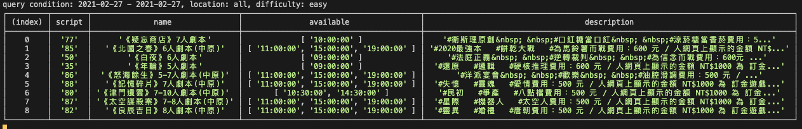
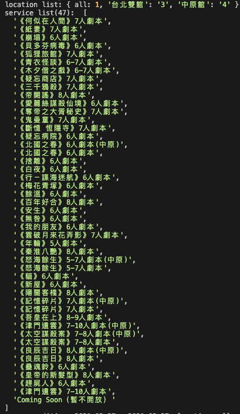

# larpwesley-scraper

use puppeteer to scraping available game time from larpwesley

## Usage
modify the condition from index.js
```js
// line 13
const dateStart = '2021-02-27', dateEnd = '2021-02-27', location = 'all', difficulty = 'easy'
```

## Result
show query condition and result


## Script / Location info
show script and location list 


[larp wesley book system](https://larpwesley.simplybook.asia/v2/#book/count/1/provider/any/)